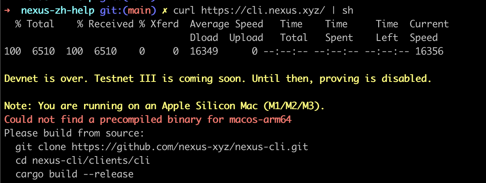
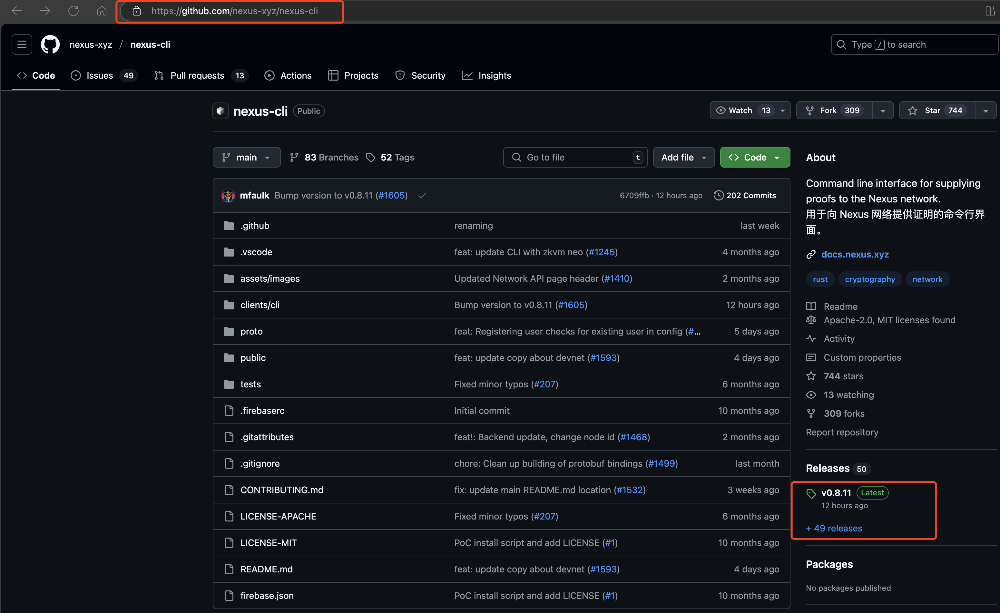
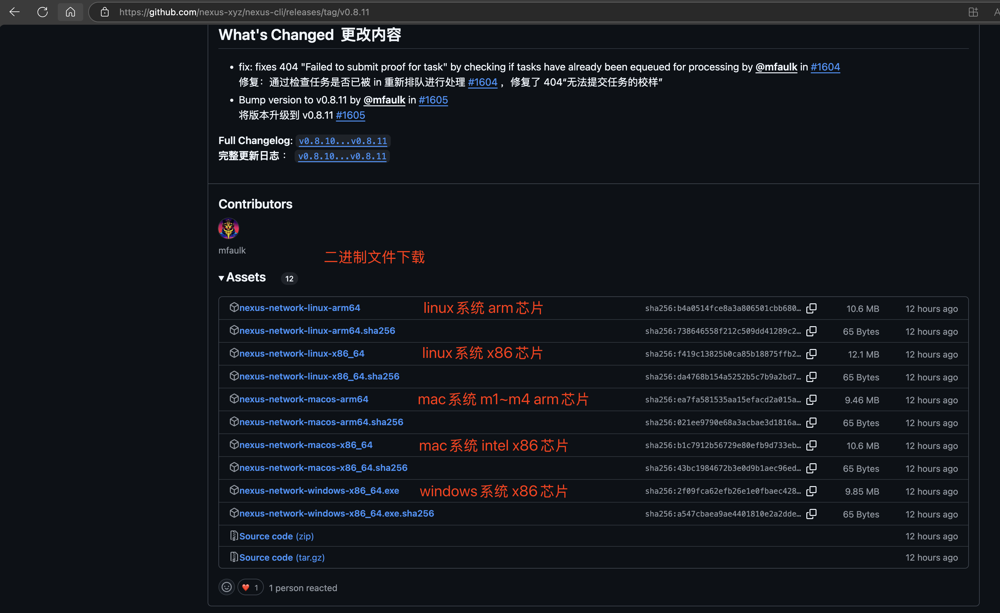
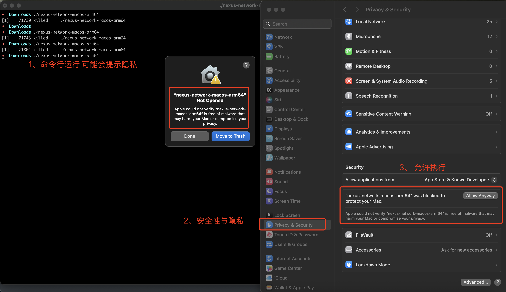
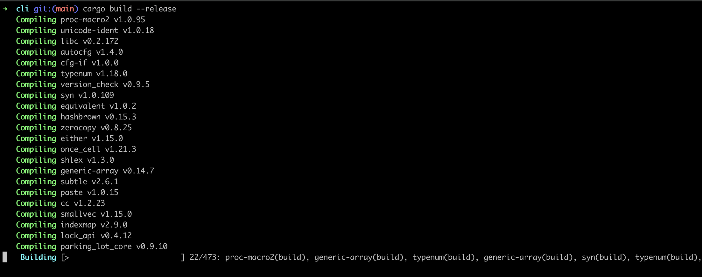
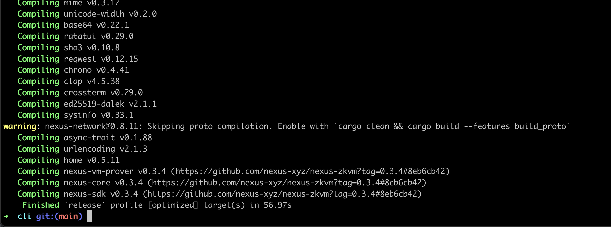
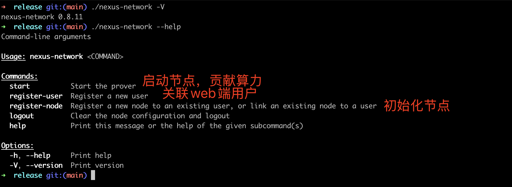
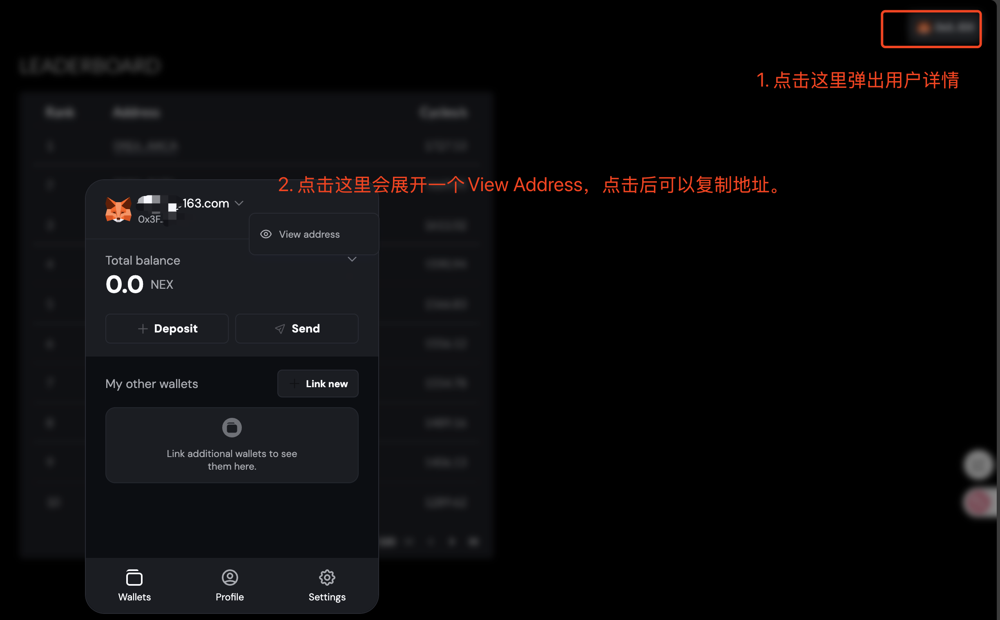
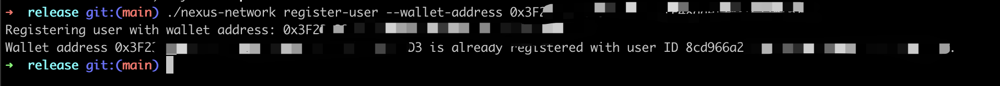
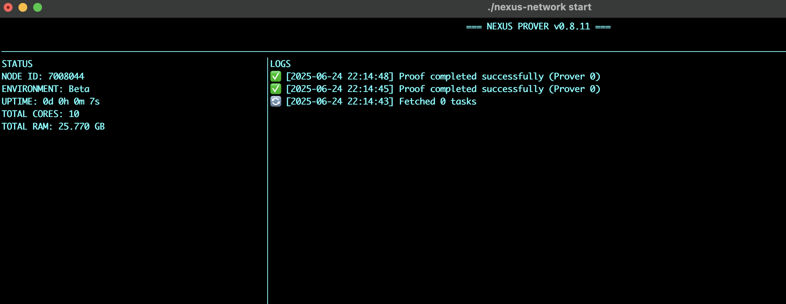

[TOC]

## nexus-cli 新手帮助

- 方便的话请给一个github的Star，谢谢。
- 运行nexus-cli，至少知道怎么在终端运行命令，否则建议使用网页版贡献算力。
- 可以先看一下[网页版说明](./nexus-web.md)，了解基本操作。nexus-cli 测试网3，增加了积分换Token功能。

## 一、快速安装
- 推荐的走源码安装，需要的请跳转到 1.4

## 1.1 二进制安装（注：不推荐）

```bash
curl https://cli.nexus.xyz/ | sh
```



>安装结果说明：苹果电脑M1~M4芯片，官方未提供二进制文件。(实际上有的，可能是这个安装脚本没更新)

### 1.2 二进制安装-非交互式（注：不推荐）

```bash
curl -sSf https://cli.nexus.xyz/ -o install.sh
chmod +x install.sh
NONINTERACTIVE=1 ./install.sh
```

### 1.3 手动下载[安装](https://github.com/nexus-xyz/nexus-cli) （注：mac不推荐，linux请自行尝试）

- 1.3.1 进入github，点击下面的发版记录

- 1.3.2 选择合适的版本下载

  - 默认情况在，下载的位置在~/Download/nexus-network-xxxx，~是的你的Home目录
  - 比如你的电脑用户名是lily，mac用户的路径是/Users/lily/Downloads/nexus-network-macos-arm64

  
  
  1.3.3 执行的时候，可能会提醒"苹果无法验证 “nexus-network-macos-arm64” 是否不含可能损害您的 Mac 或危及您隐私的恶意软件。"，如果你可以解决，可以手动下载。
  
  

### 1.4 源码安装[文档](https://docs.nexus.xyz/layer-1/testnet/cli-node)

#### 1.4.1 linux源码编译

```bash
# 更新与安装类库
sudo apt update
sudo apt upgrade
sudo apt install build-essential pkg-config libssl-dev git-all
sudo apt install protobuf-compiler

# 安装rust，如果已经安装可以跳过
curl --proto '=https' --tlsv1.2 -sSf https://sh.rustup.rs | sh

# 创建一个目录，方便新手知道程序最后在哪。
# 假如你是root用户，执行完命令后，你在/root/nexus/
# 假如你是普通用户lily，执行完命令后，你在/home/lily/nexus/
cd ~ && mkdir nexus && cd nexus
# 克隆仓库
git clone git@github.com:nexus-xyz/nexus-cli.git

# 进入到源码目录
cd nexus-cli/clients/cli

# 执行编译
cargo build --release

# 最终编译的文件在 
# root用户 /root/nexus/nexus-cli/clients/cli/target/release/nexus-network
# 普通用户lily /home/lily/nexus/nexus-cli/clients/cli/target/release/nexus-network
```

#### 1.4.2 mac依赖安装

```bash
# 更新与安装类库，需要你以前安装过homebrew
brew install protobuf

# 验证是否安装成功
# 成功则输出类似"libprotoc 29.3"
# 失败则是 command not found: protoc
protoc --version

# 安装rust，如果已经安装可以跳过
curl --proto '=https' --tlsv1.2 -sSf https://sh.rustup.rs | sh

# 创建一个目录，方便新手知道程序最后在哪。
# 假如你的mac系统用户是lily，执行完命令后，你在/Users/lily/nexus/
cd ~ && mkdir nexus && cd nexus

# 克隆仓库
git clone git@github.com:nexus-xyz/nexus-cli.git
cd nexus-cli/clients/cli

# 执行编译
cargo build --release

# 最终编译的文件在 
# mac用户lily /Users/lily/nexus/nexus-cli/clients/cli/target/release/nexus-network
```

#### 1.4.3 编译结果示例

编译中



编译成功



## 二、启动首个节点

以mac用户为例，假如你是手动下载的文件，目前你的程序在 /Users/lily/Downloads/nexus-network-macos-arm64

假如你是源码编译的文件，目前你的程序在/Users/lily/nexus/nexus-cli/clients/cli/target/release/nexus-network

为了后面演示方便，我们使用相对命令进行演示，如果你知道如何设置环境变量，或者移动文件。请自行处理。

首先，请进入到二进制所在的目录，并重命名文件为nexus-network

- 手动下载的用户请执行

```bash
# mac
cd /Users/lily/Downloads && mv nexus-network-macos-arm64 nexus-network

# linux
cd /home/lily/Downloads && mv nexus-network-linux-arm64 nexus-network
```

- 源码编译的用户请执行

```bash
cd /Users/lily/nexus/nexus-cli/clients/cli/target/release
```

### 2.1.1 给二进制文件增加可执行权限

```bash
chmod +x nexus-network
```

#### 2.1.2 查看二进制版本与帮助(可以跳过)

```bash
./nexus-network -V
./nexus-network --help
```



### 2.1.3 关联Web用户(必须执行)

```bash
# 请将0xAAAA....BBBB替换为你的钱包地址
./nexus-network register-user --wallet-address 0xAAAA....BBBB
```

钱包可以在web端复制



关联结果，提示已注册关联。



并且会生成配置文件 ~/.nexus/config.json

```bash
{
  "environment": "Beta",
  "user_id": "8cd966a2-xxxx-yyyy-zzzz-xxxxyyyyb187",
  "wallet_address": "0xAAAA....BBBB",   # 这是你的钱包公钥
  "node_id": ""  # 这里是节点地址，目前还是空的，你可以把web端的节点ID填写进去，也可以运行后面的命令，注册节点
}
```

### 2.1.4 注册首个节点

运行注册命令，会更新下面的配置文件。多出了一个node_id，如果多次执行，则会覆盖，但是Web端不会消失，可以重复使用。

```
./nexus-network register-node
```

```json
{
  "environment": "Beta",
  "user_id": "8cd966a2-xxxx-yyyy-zzzz-xxxxyyyyb187",
  "wallet_address": "0xAAAA....BBBB",   
  "node_id": "7000001"
}
```

### 2.1.5 启动首个节点

- 方式一，执行短命令，会读取上面json文件里的ID。

```
./nexus-network start
```

- 方式二，执行长命令，可以指定ID运行。

```bash
# 请记得完成前面的关联Web用户，否则会报错
./nexus-network start --node-id 7000001
```

出现截图界面，则代表执行成功



### 三、启动多个节点

如果执行了多次./nexus-network register-node，则会生成多个node_id，但是config.json里只能有一个ID。

如果你的电脑内存比较大，你可以执行多个节点，提供更多的算力。你可以在Web端的节点管理，详见[网页版说明](./nexus-web.md)，手动添加Cli节点，或者复用之前的节点，启动多个节点。(亲测 ubuntu 64G内存，可以跑4个节点)

```bash
./nexus-network start --node-id 7000001
./nexus-network start --node-id 7000002 # 这个值是Web端节点管理的那个7位数字
```

注：启动多个节点时，如果需要在后台运行，可以使用tmux或者nohup，这里不作详细介绍。
