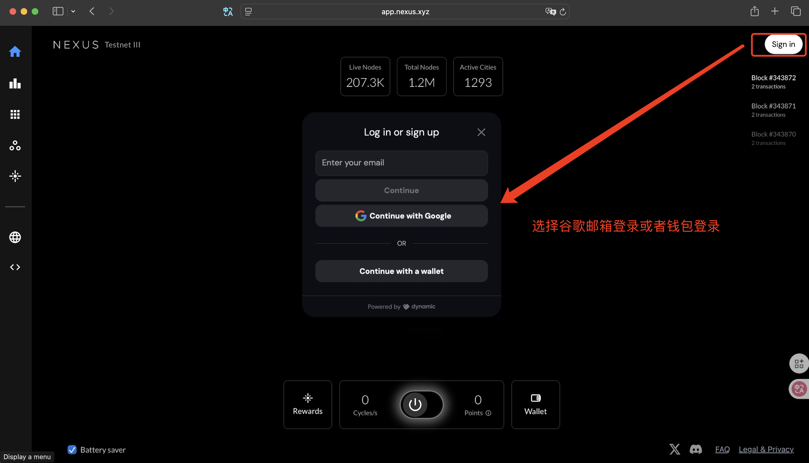
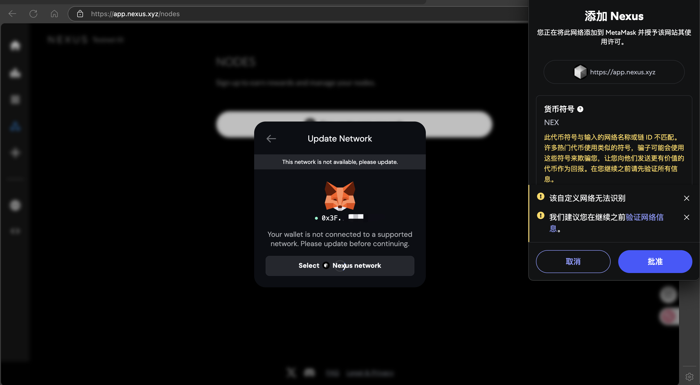
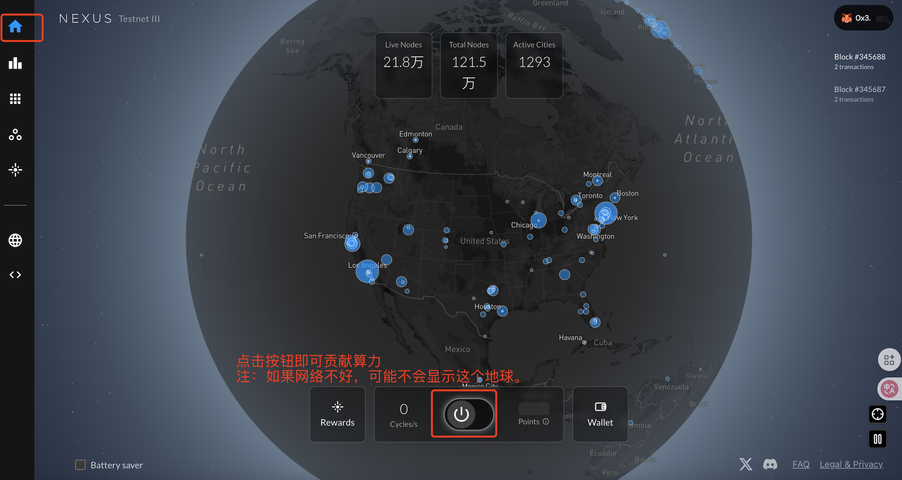
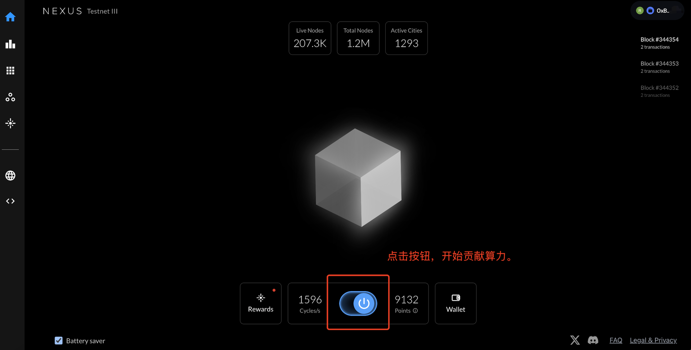
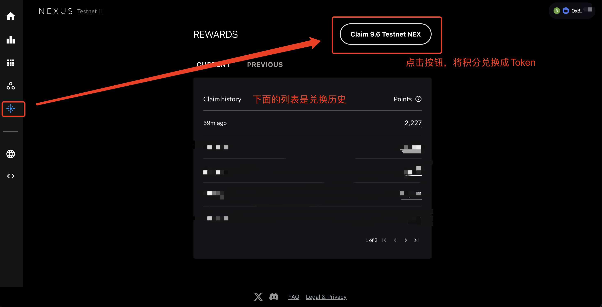
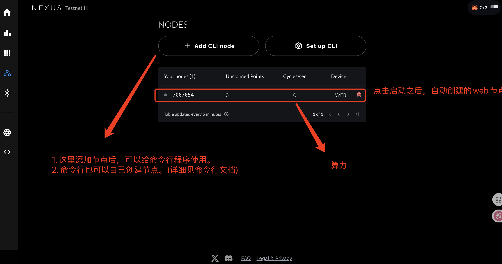
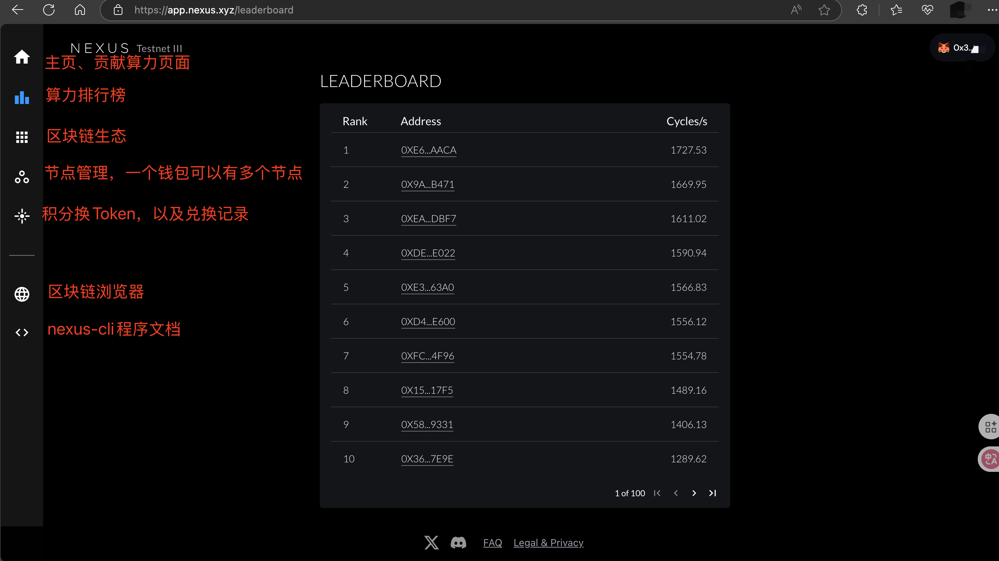

### 网页版功能介绍

1. 访问地址 https://app.nexus.xyz （需要科学上网）

2. 谷歌登录（谷歌登录会自动创建一个钱包）
    

3. 钱包登录(需要关联邮箱，具体不再演示)

  

4. 贡献算力

   

   网络不好（也可能是其他未知原因）

   

5. 将积分兑换成测试3的Token

   

6. 节点管理（nexus-cli需要用到）

   

7. 其他功能

	